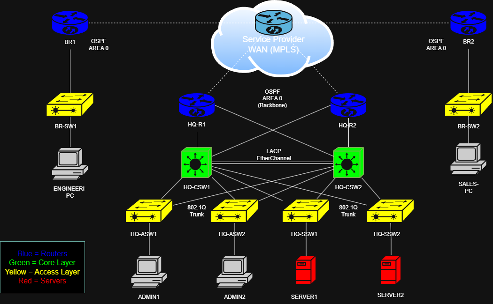

# Enterprise Network Lab

## Overview

This lab simulates a multi-site enterprise network built in **EVE-NG** using Cisco virtual routers, switches, end devices, and server infrastructure.

The lab was designed to demonstrate practical networking skills across routing, switching, redundancy, segmentation, security controls, troubleshooting, and enterprise services.

The project is split into two defined stages:

| Version | Status | Purpose |
|---|---|---|
| **V1** | Completed | Builds the CCNA-level enterprise network foundation |
| **V2** | In Progress | Expands the network with internet access and enterprise services |

V1 provides the core network design. V2 builds on that foundation by introducing services such as NAT, DHCP, DNS, Active Directory, Group Policy, and application server integration.

---

## Lab Design Summary

The lab represents a small enterprise with:

- A headquarters site
- Two branch sites
- A private WAN/MPLS-style provider network
- Department-based VLAN segmentation
- Redundant HQ core switching
- Dynamic routing between all sites
- Controlled inter-department access
- Layer 2 security features
- Centralised infrastructure services in V2

The design is intended to show how a business network can be built, secured, tested, and expanded over time.

---

## Topology

### V1 - Completed Enterprise Network Foundation

V1 focuses on the core enterprise network.

It includes:

- HQ core and access layer switching
- Engineering and Sales branch sites
- Private WAN connectivity between sites
- OSPF routing across the enterprise
- HSRP gateway redundancy at HQ
- VLAN segmentation for Admin, Servers, Engineering, and Sales
- ACLs controlling traffic between departments
- Layer 2 security controls
- End devices and servers for validation testing

  

---

### V2 - Enterprise Services Expansion

V2 extends the V1 network by adding internet edge connectivity and enterprise infrastructure services.

It introduces:

- Internet connectivity via the HQ edge
- NAT/PAT for outbound internet access
- Centralised DHCP services
- DNS services
- Active Directory Domain Services
- Domain-joined clients
- Group Policy testing
- Application server integration

  

---

## Technologies Demonstrated

### V1 - Core Networking

- VLANs and trunking
- Inter-VLAN routing using SVIs
- OSPF dynamic routing
- HSRP default gateway redundancy
- Rapid PVST+ and root bridge tuning
- LACP EtherChannel
- Access Control Lists
- DHCP Snooping
- Dynamic ARP Inspection
- Port Security
- PortFast and BPDU Guard
- SSH management access
- End-to-end testing and failover validation

### V2 - Enterprise Services

- Internet edge design
- NAT/PAT
- Default route advertisement into OSPF
- DHCP relay using `ip helper-address`
- Centralised DHCP scopes
- DNS services
- Active Directory Domain Services
- Organisational Units, users, and groups
- Group Policy Objects
- Application server access control

---

## IP Addressing Design

The lab primarily uses private IP addressing to simulate an internal enterprise WAN.

Key design points:

- Internal VLANs use private IPv4 addressing
- WAN links use `/30` point-to-point subnets
- Loopback interfaces are used for router identification and testing
- OSPF advertises internal routes between HQ, ISP, and branch routers
- V1 remains fully private with no internet breakout
- V2 introduces NAT at the HQ edge for outbound internet access

This separation makes it clear how the original private enterprise network was later expanded to include internet connectivity and centralised services.

---

## Lab Environment

The lab is built using:

- **EVE-NG** for network emulation
- **Cisco IOS routers**
- **Cisco IOS Layer 2/Layer 3 switches**
- **Virtual PCs** for endpoint testing
- **Windows Server VM** for DHCP, DNS, Active Directory, and Group Policy in V2

The environment allows routing, switching, redundancy, segmentation, security, and infrastructure services to be tested in a controlled virtual lab.

---

## Objectives

### V1 Objectives

The objective of V1 was to build a complete enterprise network foundation.

V1 implements:

- Department-based VLAN segmentation
- Inter-VLAN routing at the HQ core
- Redundant default gateways using HSRP
- STP tuning to align Layer 2 forwarding with gateway redundancy
- EtherChannel between HQ core switches
- OSPF routing across HQ, WAN, ISP, and branch routers
- ACLs to restrict Engineering and Sales traffic
- Layer 2 security controls on access ports and trunks
- SSH management access
- End-to-end connectivity and failover testing

### V2 Objectives

The objective of V2 is to make the lab more realistic by adding enterprise services.

V2 introduces:

- Internet access from internal VLANs
- NAT/PAT at the HQ edge
- Centralised DHCP from a server
- DNS and Active Directory domain services
- Domain-joined clients across multiple VLANs
- Group Policy testing
- Application server integration
- Additional validation and troubleshooting documentation

---

## Current Status

### V1 - Completed

V1 has been implemented and tested.

Completed areas include:

- Router and switch configuration
- VLANs and trunking
- Inter-VLAN routing
- HSRP redundancy
- OSPF routing
- EtherChannel
- ACL enforcement
- Layer 2 security
- SSH management
- Connectivity and failover validation

V1 is currently being reviewed and polished to ensure all documentation, links, testing notes, and configuration references are accurate.

---

### V2 - In Progress

V2 has been partially implemented and documented.

Completed or partially completed areas include:

- Internet edge design
- NAT/PAT configuration
- DHCP services
- DHCP relay
- DNS and Active Directory services
- Group Policy testing

Remaining work includes:

- Application server integration
- Final V2 testing and validation
- Final configuration change documentation

---

## Lab Documentation

### V1 Documentation

- [V1 Overview](labs/v1/)
- [00 - Base Configuration](labs/v1/00-base-config.md)
- [01 - Core Setup](labs/v1/01-core-setup.md)
- [02 - Access Layer](labs/v1/02-access-layer.md)
- [03 - Routing with OSPF](labs/v1/03-routing-ospf.md)
- [04 - Branch Switches](labs/v1/04-branch-switches.md)
- [05 - Access Control Lists](labs/v1/05-access-control-lists.md)
- [06 - Testing and Validation](labs/v1/06-testing.md)

### V2 Documentation

- [V2 Overview](labs/v2/)
- [01 - Internet and Edge Connectivity](labs/v2/01-internet-%26-edge.md)
- [02 - DHCP Services](labs/v2/02-dhcp-services.md)
- [03 - DNS and Domain Services](labs/v2/03-dns-%26-domain-services.md)
- [04 - Application Server Integration](labs/v2/04-application-server-integration.md)

### Configuration Files

- [Full Device Configurations](configs/)
- [V2 Configuration Changes](configs/changes-v2/)

### Topology Files

- [Topology Overview](topology/)
- [V1 Topology](topology/v1/)
- [V2 Topology](topology/v2/)

---

## Project Outcome

This lab helped demonstrate the practical skills required for a junior networking role by showing more than just configuration commands.

It shows the ability to:

- Design a realistic enterprise network
- Build the network in a virtual lab
- Configure routers and switches
- Validate redundancy and routing behaviour
- Apply segmentation and access control
- Troubleshoot implementation issues
- Document the work clearly for technical review

V1 provides the completed networking foundation, while V2 shows how the same environment can be expanded with enterprise services.
