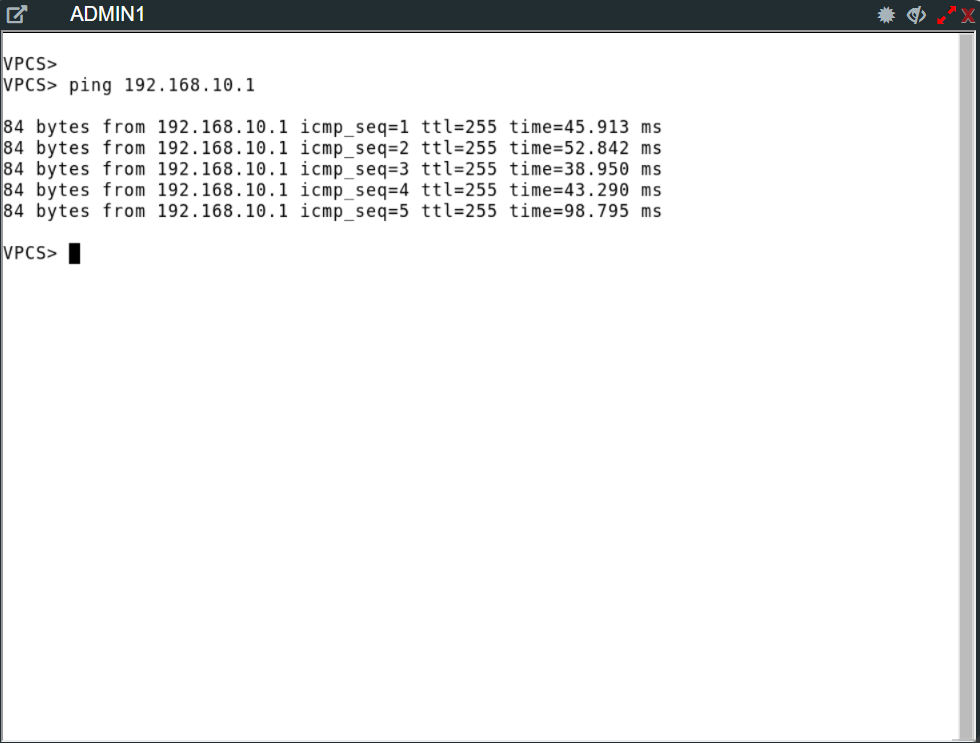
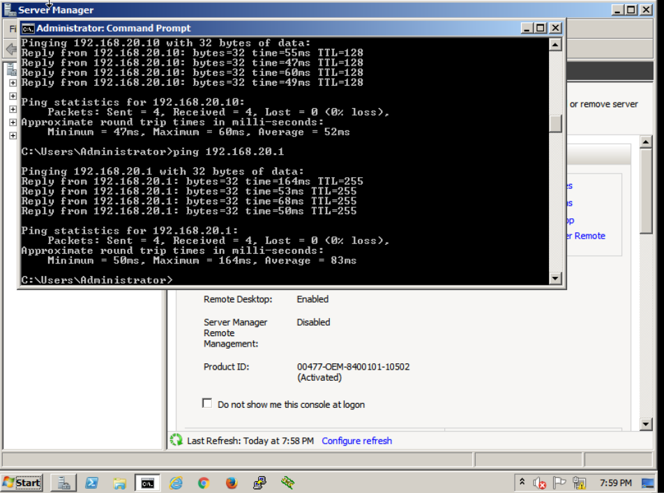
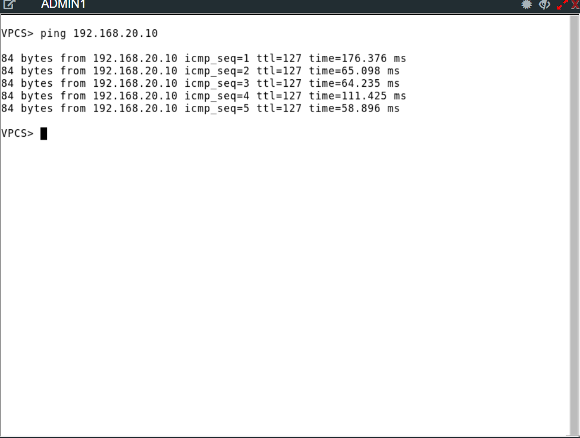

# 02 - Access Layer Configuration

## Objective

The objective of this phase is to configure the access layer switches to provide reliable end-device connectivity, enforce VLAN segmentation, and implement secure Layer 2 operations.

This includes:

- VLAN implementation on access switches
- Trunk configuration to the core layer
- Access port configuration for end devices
- Layer 2 security features
- End-device IP configuration and connectivity validation

---

## Access Layer Design

The access layer consists of:

- HQ-ASW1 / HQ-ASW2 → Admin users (VLAN 10)
- HQ-SSW1 / HQ-SSW2 → Servers (VLAN 20)

Each access switch is dual-homed to both core switches, providing redundancy and high availability.

The access layer operates purely at Layer 2, with all routing handled by the core layer via SVIs.

---

## Spanning Tree Protocol

Rapid PVST+ is implemented across all switches in the network to provide fast Layer 2 convergence.

The full configuration and design details are documented in the Core Layer Setup section:

👉 [View Spanning Tree Configuration](01-core-setup.md)

---

### Design Justification
- Enables faster convergence during topology changes
- Improves failover performance in redundant Layer 2 designs
- Aligns with enterprise best practices for modern switching environments
- Ensures consistent Spanning Tree behaviour across all switches

--- 

## VLAN Configuration

VLANs were created on all access switches to ensure consistency with the core layer.

```bash
vlan 10
 name ADMIN

vlan 20
 name SERVERS
```

---

## Management Access (SVI for SSH)

Although the access switches operate purely at Layer 2, they still require an IP address for remote management.

To support SSH access, each access switch is configured with a management SVI in VLAN 10. This provides a reachable IP address for administration, while the default gateway points to the HSRP virtual IP on the core layer.

VLAN 10 is used as the management VLAN because it already exists across the HQ access layer and has routed reachability through the core switches.

---

### Management IP Addressing

- HQ-ASW1 → 192.168.10.4
- HQ-ASW2 → 192.168.10.5
- HQ-SSW1 → 192.168.10.6
- HQ-SSW2 → 192.168.10.7

Default gateway for all access switches:

```text
192.168.10.1
```

---

### HQ-ASW1 Configuration

```cisco
interface vlan 10
 ip address 192.168.10.4 255.255.255.0
 no shutdown

ip default-gateway 192.168.10.1
```

---

### HQ-ASW2 Configuration

```cisco
interface vlan 10
 ip address 192.168.10.5 255.255.255.0
 no shutdown

ip default-gateway 192.168.10.1
```

---

### HQ-SSW1 Configuration

```cisco
interface vlan 10
 ip address 192.168.10.6 255.255.255.0
 no shutdown

ip default-gateway 192.168.10.1
```

---

### HQ-SSW2 Configuration

```cisco
interface vlan 10
 ip address 192.168.10.7 255.255.255.0
 no shutdown

ip default-gateway 192.168.10.1
```

---

## Uplink Configuration (Trunk Links)

Interfaces connecting access switches to the core were configured as trunk ports:

```bash
interface range gi0/0 - 1
 switchport trunk encapsulation dot1q
 switchport mode trunk
 switchport trunk allowed vlan 10,20
 switchport nonegotiate
```

### Key Design Decisions
- 802.1Q encapsulation required due to platform limitations
- Only VLANs 10 and 20 allowed across trunks
- DTP disabled to prevent unwanted trunk negotiation
- Dual uplinks provide redundancy to both core switches

---

## Access Port Configuration

Access ports were configured to assign end devices to the correct VLAN and enable fast convergence.

### Admin Switches (VLAN 10)

```bash
interface gi0/2
 switchport mode access
 switchport access vlan 10
 spanning-tree portfast
 spanning-tree bpduguard enable
```

### Server Switches (VLAN 20)

```bash
interface gi0/2
 switchport mode access
 switchport access vlan 20
 spanning-tree portfast
 spanning-tree bpduguard enable
```

---

## Layer 2 Security Features

Several security features were implemented on access ports:

### PortFast
- Allows immediate transition to forwarding state
- Eliminates unnecessary delay for end devices

### BPDU Guard
- Protects against rogue switches
- Automatically disables port if BPDU is received

These features help maintain network stability and security at the access layer.

---

## End Device Configuration

End devices were configured with static IP addressing.

### Admin PCs 

```text
IP Address: 192.168.10.10
Subnet Mask: 255.255.255.0
Default Gateway: 192.168.10.1
```
```text
IP Address: 192.168.10.11
Subnet Mask: 255.255.255.0
Default Gateway: 192.168.10.1
```

### Servers

```text
IP Address: 192.168.20.10
Subnet Mask: 255.255.255.0
Default Gateway: 192.168.20.1
```

```text
IP Address: 192.168.20.11
Subnet Mask: 255.255.255.0
Default Gateway: 192.168.20.1
```

---

## Connectivity Testing

The following tests were performed to validate the network:

### Layer 2 Connectivity
- Successful communication between devices within the same VLAN

### Gateway Reachability

```bash
ping 192.168.10.1
ping 192.168.20.1
```




---

### Inter-VLAN Routing

```bash
ping 192.168.20.10
```



---

## Observations
- Intra-VLAN communication confirmed correct Layer 2 switching
- Gateway reachability verified SVI functionality on the core
- Inter-VLAN communication confirmed routing operation
- Initial packet loss observed due to ARP resolution (expected behaviour)

---

## Troubleshooting

### Issue Encountered: SVI Down

During testing, the default gateway was initially unreachable.
This was caused by the VLAN interface (SVI) being in a down/down state on the core switch.

The issue was resolved by enabling the interface:

```bash
interface vlan 10
 no shutdown
```

### Key Takeaway:

An SVI requires:
- The VLAN to exist
- Active Layer 2 participation
- The interface to be administratively enabled

---

## Advanced Security – Dynamic ARP Inspection (DAI)

Dynamic ARP Inspection (DAI) was implemented on the access layer switches to protect against ARP spoofing and man-in-the-middle attacks.

DAI works by validating ARP packets against a trusted database of IP-to-MAC bindings before allowing them to be forwarded.

---

### Configuration

DAI was enabled for the relevant VLANs:

```bash
ip arp inspection vlan 10,20
```

---

## DHCP Snooping Dependency

DAI relies on DHCP Snooping to build a binding table of valid IP-to-MAC mappings.

```bash
ip dhcp snooping
ip dhcp snooping vlan 10,20
```

---

### Trusted Interfaces (Uplinks)

Uplink interfaces toward the core switches were configured as trusted:

```bash
interface range gi0/0 - 1
 ip dhcp snooping trust
 ip arp inspection trust
```

---

### Untrusted Interfaces (Access Ports)

- All access ports remain untrusted by default.
- ARP packets received on these ports are inspected.
- Invalid ARP packets are dropped.

---

### Static IP Addressing Consideration

Since static addressing is used, manual bindings were required:

### Example:
```bash
ip source binding 5000.0002.0000 vlan 20 192.168.20.10 interface gi0/2
```
Without these bindings, ARP traffic is dropped and devices cannot communicate.

---

### Verification

DAI operation was verified using:

```bash
show ip arp inspection statistics
show ip arp inspection interfaces
show ip source binding
```


---

### Observations
- ARP traffic from valid devices was successfully permitted
- ARP traffic was dropped when bindings were missing
- Connectivity was restored after adding correct bindings

This confirms that DAI is actively inspecting and protecting Layer 2 traffic.

---

### Observations
- Valid ARP traffic permitted
- Invalid traffic dropped when bindings missing
- Connectivity restored after correct bindings

--- 

### Design Justification
DAI is implemented only at the access layer, where end devices connect and ARP attacks originate.

Core devices are treated as trusted infrastructure.

---

## Advanced Security - Port Security

Port security was implemented to restrict access at the access layer.

---

### Configuration

```bash
interface gi0/2
 switchport mode access
 switchport access vlan 10
 switchport port-security
 switchport port-security maximum 1
 switchport port-security mac-address sticky
 switchport port-security violation restrict
```

---

## Key Settings
- Maximum 1 MAC address → prevents multiple devices
- Sticky MAC → dynamically learns and saves MAC
- Violation restrict → drops traffic without shutting down port

---

## Behaviour
- First connected device is learned automatically
- MAC address stored in running config
- Unauthorized devices are blocked

---

### Verification

Port security was verified using:

```bash
show port-security interface gi0/2
show port-security address
```


---

### Observations
- MAC address successfully learned and secured
- Unauthorized devices blocked
- Interface remains operational due to restrict mode

---

### Design Justification

Port security enforces device-level access control at the edge, complementing:
- DHCP Snooping
- Dynamic ARP Inspection
Together, these provide layered Layer 2 security.

---


## Summary

The access layer provides:
- VLAN-based segmentation
- Secure and stable access port configuration
- Redundant uplinks to the core
- Reliable end-device connectivity
At this stage, the LAN is fully operational, with routing handled by the core layer.

---
