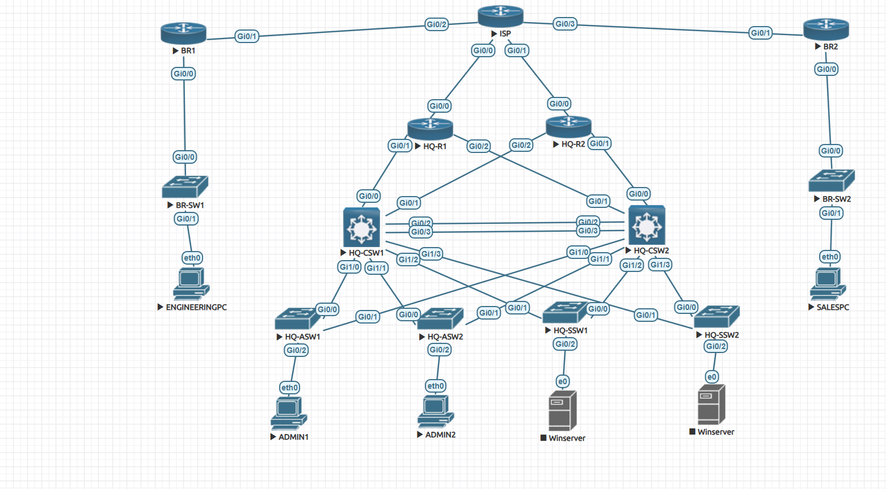

# 03 - Routing with OSPF

## Overview

This phase configures dynamic routing for the V1 Enterprise Network Lab.

OSPF is used to provide routed connectivity between:

- HQ core switches
- HQ WAN routers
- Simulated ISP / WAN provider router
- Engineering branch router
- Sales branch router
- HQ VLAN networks
- Branch LAN networks

This phase connects the previously configured HQ LAN to the wider enterprise WAN and allows all required networks to learn routes dynamically.

---

## Objective

The objective of this phase is to configure OSPF across the routed parts of the lab.

This includes:

- Enabling OSPF on all Layer 3 devices
- Advertising HQ VLAN networks
- Advertising branch LAN networks
- Advertising WAN transit networks
- Advertising loopback interfaces
- Using passive interfaces where neighbour relationships are not required
- Verifying OSPF neighbours, routes, and end-to-end reachability

---

## Topology Reference

The screenshot below shows the V1 EVE-NG topology.



OSPF runs across the HQ core switches, HQ routers, simulated ISP router, and branch routers.

Access switches do not participate in OSPF because they operate as Layer 2 switches in V1.

---

## Routing Design

V1 uses a single OSPF area:

```text
Area 0
```

Using one backbone area keeps the design simple and appropriate for a CCNA-level enterprise lab.

| Device Type | Devices | OSPF Role |
|---|---|---|
| HQ Core Switches | HQ-CSW1, HQ-CSW2 | Advertise HQ VLANs, loopbacks, and routed links to HQ routers |
| HQ Routers | HQ-R1, HQ-R2 | Provide routed connectivity between HQ core and ISP/WAN |
| ISP Router | ISP | Simulates private WAN/MPLS-style transit between HQ and branches |
| Branch Routers | BR1, BR2 | Advertise Engineering and Sales branch LANs |

---

## IP Addressing Strategy

The lab uses private IP addressing throughout V1.

### LAN Networks

| Network | Purpose |
|---|---|
| 192.168.10.0/24 | Admin VLAN |
| 192.168.20.0/24 | Server VLAN |
| 192.168.30.0/24 | Engineering branch LAN |
| 192.168.40.0/24 | Sales branch LAN |

### WAN / Transit Networks

The routed WAN links use `/30` point-to-point networks.

| Network | Link |
|---|---|
| 10.0.0.0/30 | HQ-R1 to ISP |
| 10.0.0.4/30 | HQ-R2 to ISP |
| 10.0.0.8/30 | ISP to BR1 |
| 10.0.0.12/30 | ISP to BR2 |
| 10.0.1.0/30 | HQ-CSW1 to HQ-R1 |
| 10.0.1.4/30 | HQ-CSW2 to HQ-R1 |
| 10.0.1.8/30 | HQ-CSW1 to HQ-R2 |
| 10.0.1.12/30 | HQ-CSW2 to HQ-R2 |

### Loopback Interfaces

Loopback interfaces are used for stable router identification, OSPF router IDs, SSH testing, and route validation.

| Device | Loopback |
|---|---|
| HQ-CSW1 | 1.1.1.1/32 |
| HQ-CSW2 | 2.2.2.2/32 |
| HQ-R1 | 3.3.3.3/32 |
| HQ-R2 | 4.4.4.4/32 |
| ISP | 5.5.5.5/32 |
| BR1 | 6.6.6.6/32 |
| BR2 | 7.7.7.7/32 |

---

## Why OSPF Was Used

OSPF was chosen because it is a common enterprise dynamic routing protocol and is included in the CCNA exam objectives.

OSPF provides:

- Dynamic route learning
- Automatic route recalculation after link changes
- Support for redundant paths
- Better scalability than static routing
- Clear route visibility in the routing table
- A realistic enterprise WAN routing design

In this lab, OSPF removes the need to manually configure static routes between every HQ and branch network.

---

## Why /30 Networks Were Used

The WAN and routed core links use `/30` point-to-point networks.

A `/30` subnet provides:

- 2 usable IP addresses
- One IP address for each side of the point-to-point link
- Efficient use of address space
- Clear separation between routed links

This is a common design approach for traditional point-to-point WAN links.

---

## Why Loopbacks Were Advertised

Loopback interfaces were advertised into OSPF because they provide stable device addresses.

Unlike physical interfaces, loopbacks remain up as long as the device is operational.

This makes them useful for:

- OSPF router IDs
- Device identification
- SSH management testing
- Reachability testing
- Troubleshooting routing behaviour

Each loopback is advertised as a `/32` host route in OSPF.

---

## OSPF Configuration Approach

OSPF process ID `1` is used across the lab.

```cisco
router ospf 1
```

Each Layer 3 device uses a router ID that matches its loopback address.

Example:

```cisco
router ospf 1
 router-id 1.1.1.1
```

All networks are placed into Area 0.

Example:

```cisco
network 10.0.1.0 0.0.0.3 area 0
```

---

## Example OSPF Configuration - HQ-CSW1

HQ-CSW1 advertises:

- Its loopback
- HQ VLAN 10
- HQ VLAN 20
- Routed link to HQ-R1
- Routed link to HQ-R2

```cisco
router ospf 1
 router-id 1.1.1.1
 passive-interface Loopback0
 passive-interface Vlan10
 passive-interface Vlan20
 network 1.1.1.1 0.0.0.0 area 0
 network 10.0.1.0 0.0.0.3 area 0
 network 10.0.1.8 0.0.0.3 area 0
 network 192.168.10.0 0.0.0.255 area 0
 network 192.168.20.0 0.0.0.255 area 0
```

The VLAN interfaces are passive because end-user VLANs should not form OSPF neighbour relationships.

The networks are still advertised into OSPF.

---

## Example OSPF Configuration - HQ-R1

HQ-R1 advertises:

- Its loopback
- Link to ISP
- Link to HQ-CSW1
- Link to HQ-CSW2

```cisco
router ospf 1
 router-id 3.3.3.3
 passive-interface Loopback0
 network 3.3.3.3 0.0.0.0 area 0
 network 10.0.0.0 0.0.0.3 area 0
 network 10.0.1.0 0.0.0.3 area 0
 network 10.0.1.4 0.0.0.3 area 0
```

---

## Example OSPF Configuration - BR1

BR1 advertises:

- Its loopback
- WAN link to ISP
- Engineering branch LAN

```cisco
router ospf 1
 router-id 6.6.6.6
 passive-interface GigabitEthernet0/0
 passive-interface Loopback0
 network 6.6.6.6 0.0.0.0 area 0
 network 10.0.0.8 0.0.0.3 area 0
 network 192.168.30.0 0.0.0.255 area 0
```

The branch LAN interface is passive because the Engineering LAN should be advertised, but it does not need to form OSPF neighbours with end devices.

---

## Passive Interface Design

Passive interfaces are used to prevent unnecessary OSPF neighbour formation.

### Passive Interfaces Used

| Device Type | Passive Interfaces | Reason |
|---|---|---|
| Core switches | Loopback0, VLAN 10, VLAN 20 | Advertise loopbacks and VLANs without forming neighbours on those interfaces |
| HQ routers | Loopback0 | Advertise stable loopback addresses |
| Branch routers | Loopback0, LAN interface | Advertise loopbacks and branch LANs without forming neighbours on user-facing LANs |
| ISP router | Loopback0 | Advertise stable loopback address |

This improves routing hygiene and keeps OSPF neighbour formation limited to routed infrastructure links.

---

## Expected OSPF Neighbour Relationships

OSPF neighbours should form only across routed point-to-point links.

Expected neighbour relationships include:

| Device | Expected OSPF Neighbours |
|---|---|
| HQ-CSW1 | HQ-R1, HQ-R2 |
| HQ-CSW2 | HQ-R1, HQ-R2 |
| HQ-R1 | HQ-CSW1, HQ-CSW2, ISP |
| HQ-R2 | HQ-CSW1, HQ-CSW2, ISP |
| ISP | HQ-R1, HQ-R2, BR1, BR2 |
| BR1 | ISP |
| BR2 | ISP |

No OSPF neighbours should form on:

- Admin VLAN
- Server VLAN
- Engineering LAN
- Sales LAN
- Loopback interfaces

---

## Routing Behaviour

After OSPF is configured:

- HQ core switches learn routes to Engineering and Sales branch networks
- Branch routers learn routes to HQ Admin and Server VLANs
- HQ routers learn internal HQ VLANs and remote branch networks
- ISP acts as the simulated private WAN transit router
- Loopbacks become reachable across the network
- OSPF recalculates paths automatically if a routed link fails

---

## Redundancy Behaviour

The V1 topology includes multiple routed paths between the HQ core and WAN edge.

This provides:

- Dual HQ core switches
- Dual HQ routers
- Multiple routed links between core and WAN routers
- OSPF route recalculation during failures
- Equal-cost route options where available

OSPF can use equal-cost multipath where multiple routes have the same cost.

This provides route redundancy without relying on manual static route changes.

---

## Verification Commands

The following commands were used to verify OSPF routing.

| Command | Purpose |
|---|---|
| `show ip ospf neighbor` | Confirms OSPF neighbour relationships |
| `show ip route` | Verifies learned OSPF routes |
| `show ip protocols` | Shows OSPF process details and advertised networks |
| `show ip route ospf` | Displays OSPF-learned routes only |
| `show ip route \| include 1.1.1.1\|2.2.2.2\|3.3.3.3\|4.4.4.4\|5.5.5.5\|6.6.6.6\|7.7.7.7` | Confirms loopback routes are learned |

---

## Verification Evidence

### OSPF Neighbour Verification

`show ip ospf neighbor` was used to confirm that OSPF adjacencies formed correctly.


---

### Routing Table Verification

`show ip route` was used to confirm that remote networks were learned dynamically.


---

### OSPF Protocol Verification

`show ip protocols` was used to confirm OSPF process details, router ID, passive interfaces, and advertised networks.


---

### Loopback Route Verification

The routing table was filtered to confirm that loopback routes were being learned.

```cisco
show ip route | include 1.1.1.1|2.2.2.2|3.3.3.3|4.4.4.4|5.5.5.5|6.6.6.6|7.7.7.7
```


---

## Connectivity Testing

Connectivity testing was performed to confirm that OSPF was providing end-to-end routing across the enterprise network.

### Branch Gateway Reachability

The HQ side was tested against the Engineering and Sales branch gateways.

```cisco
ping 192.168.30.1
ping 192.168.40.1
```


---

## Expected Results

At the end of this phase:

- OSPF is enabled on all Layer 3 network devices
- OSPF Area 0 is used across the routed topology
- OSPF neighbours form across routed infrastructure links
- HQ VLAN networks are advertised
- Branch LAN networks are advertised
- WAN transit networks are advertised
- Loopback interfaces are advertised as reachable routes
- User-facing VLANs and LANs are passive
- Branch networks are reachable from HQ
- HQ networks are reachable from branch sites
- Remote loopbacks are reachable across the network
- Static routes are not required for internal V1 reachability

---

## Design Notes

### Why the ISP Router Participates in OSPF

The ISP router is used as a simulated private WAN/MPLS-style transit device.

In this lab, it participates in OSPF so that enterprise routes can be exchanged across the simulated WAN.

This is not intended to represent a normal public internet provider relationship. It represents a controlled private WAN lab environment.

### Why No NAT Is Used in V1

V1 is a private enterprise WAN design.

It focuses on internal routing between HQ and branch sites.

NAT and internet access are intentionally not included in V1. They are introduced later in V2.

### Why Access Switches Do Not Run OSPF

The HQ access switches operate at Layer 2 in V1.

They provide endpoint connectivity, VLAN assignment, trunking, and access-layer security.

Routing is handled by the HQ core switches and routers, so the access switches do not need to participate in OSPF.

---

## Platform Note

This lab was built using virtual Cisco images in EVE-NG.

Some default or platform-generated CLI output may vary between devices. The published configurations and documentation focus on the relevant working configuration and design intent.

---

## Outcome

OSPF was successfully configured across the V1 routed network.

This provided:

- Dynamic route learning between HQ and branch sites
- Reachability between HQ VLANs and branch LANs
- Reachability to loopback interfaces
- Redundant routed paths through the HQ core and WAN edge
- Automatic route recalculation if a routed path changes

At this stage, the enterprise network has full internal routing between HQ, the simulated WAN, and both branch sites.

---

## Key Learning

This phase reinforced several important routing concepts:

- OSPF provides scalable dynamic routing for enterprise networks
- Router IDs should be stable and predictable
- Loopbacks are useful for router identification and management testing
- Passive interfaces advertise networks without forming unnecessary neighbours
- `/30` subnets are efficient for point-to-point routed links
- OSPF can provide redundancy and automatic recalculation after failures
- Access switches do not need to run OSPF when routing is handled at the core

---

## Related Documentation

- [Previous: 02 - Access Layer](02-access-layer.md)
- [Next: 04 - Branch Switches](04-branch-switches.md)
- [V1 Overview](./)
- [V1 Topology](../../topology/v1/)
- [Device Configurations](../../configs/)

---
