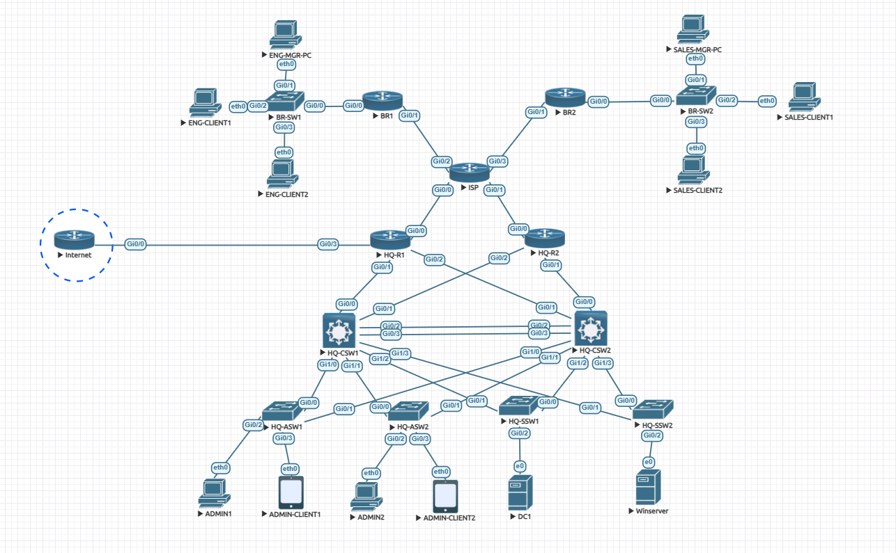

# 01 - Internet Edge and NAT

## Overview

This phase expands the completed V1 Enterprise Network Lab by adding internet edge connectivity and Network Address Translation.

In V1, the lab focused on private internal connectivity between HQ and branch sites. V2 adds an external network connection from HQ so internal devices can send traffic towards a simulated internet environment.

HQ-R1 is used as the internet edge router.

This phase introduces:

- Internet-facing connectivity on HQ-R1
- NAT inside and outside interface roles
- Port Address Translation using PAT overload
- A default route towards the simulated internet
- OSPF default route advertisement
- Validation of NAT translations

---

## Objective

The objective of this phase is to allow internal private networks to reach external destinations through a centralised HQ internet edge.

This includes:

- Adding an external interface to HQ-R1
- Marking internal interfaces as NAT inside
- Marking the internet-facing interface as NAT outside
- Matching internal private networks using a NAT ACL
- Translating internal addresses using PAT overload
- Configuring a default route towards the simulated internet
- Advertising the default route into OSPF
- Verifying NAT translations and routing behaviour

---

## Topology Reference

The screenshot below shows the V2 EVE-NG topology.



V2 builds on the completed V1 topology by adding an external network connection from HQ-R1.

HQ-R1 now acts as the boundary between:

- The internal enterprise network
- The simulated external/internet network

---

## Relationship to V1

V1 used private internal routing only.

There was no internet access, no NAT, and no default route advertised into the enterprise network.

V2 keeps the existing V1 routing, switching, VLANs, HSRP, OSPF, ACLs, and Layer 2 security design, then adds internet edge functionality at HQ-R1.

| Area | V1 | V2 |
|---|---|---|
| Internal routing | OSPF between HQ and branches | Retained |
| Internet access | Not included | Added through HQ-R1 |
| NAT/PAT | Not included | Added on HQ-R1 |
| Default route | Not required | Added towards simulated internet |
| OSPF default advertisement | Not included | Added using `default-information originate` |

---

## Internet Edge Design

HQ-R1 is used as the central internet edge router.

This keeps internet breakout centralised at HQ rather than adding separate internet connections at each branch.

| Device | Role |
|---|---|
| HQ-R1 | NAT boundary and internet edge |
| External router/network | Simulated internet environment |
| Internal routers/switches | Learn default route towards HQ-R1 through OSPF |

The internal enterprise network continues to use private addressing.

The external connection uses a simulated public IP range for testing.

---

## Interface Role Summary

HQ-R1 has both internal and external-facing interfaces.

| Interface | Role | NAT Direction |
|---|---|---|
| GigabitEthernet0/0 | Internal / enterprise-facing | NAT inside |
| GigabitEthernet0/1 | Internal / enterprise-facing | NAT inside |
| GigabitEthernet0/2 | Internal / enterprise-facing | NAT inside |
| GigabitEthernet0/3 | External / simulated internet-facing | NAT outside |

The exact internal interface roles depend on the HQ-R1 connections to the existing V1 topology.

The key design point is that all enterprise-facing interfaces are marked as `ip nat inside`, while the internet-facing interface is marked as `ip nat outside`.

---

## External Network Simulation

The external network is simulated inside EVE-NG.

It represents an upstream internet/ISP environment and is used to validate NAT and routing behaviour.

Example external subnet:

```text
203.0.113.0/30
```

Example addressing:

| Device / Interface | IP Address | Purpose |
|---|---|---|
| External router / next hop | 203.0.113.1/30 | Simulated internet next hop |
| HQ-R1 Gi0/3 | 203.0.113.2/30 | HQ-R1 internet-facing interface |

The `203.0.113.0/24` range is commonly used for documentation and lab examples, making it suitable for a simulated public network in this portfolio.

---

## NAT Design

Internal networks use private IP addressing.

The NAT policy translates traffic from the internal enterprise address range:

```text
192.168.0.0/16
```

This covers the main internal LAN and VLAN networks used in the lab, including:

| Network | Purpose |
|---|---|
| 192.168.10.0/24 | Admin VLAN |
| 192.168.20.0/24 | Server VLAN |
| 192.168.30.0/24 | Engineering branch |
| 192.168.40.0/24 | Sales branch |

The routed WAN and transit networks use `10.x.x.x` addressing and are not included in the NAT ACL.

This is intentional because transit infrastructure networks should not normally be translated for user internet access.

---

## Why PAT Was Used

PAT, also known as NAT overload, allows multiple internal private IP addresses to share one external interface address.

This is realistic because most enterprise networks do not have one public IP address for every internal client.

PAT allows internal devices to access external destinations while conserving public address space.

---

## NAT ACL Configuration

A standard ACL is used to match the internal private networks that should be translated.

```cisco
access-list 1 permit 192.168.0.0 0.0.255.255
```

This matches the internal `192.168.0.0/16` range.

It intentionally does not match the `10.x.x.x` WAN/transit networks.

---

## PAT Configuration

PAT is configured using the internet-facing interface on HQ-R1.

```cisco
ip nat inside source list 1 interface GigabitEthernet0/3 overload
```

This means:

- Traffic matching ACL 1 is eligible for NAT
- The translated address uses the IP address on `GigabitEthernet0/3`
- Multiple internal hosts can share the same outside interface address
- Port numbers are used to keep sessions unique

---

## HQ-R1 Interface Configuration

### Internal Interfaces

The internal HQ-R1 interfaces are configured as NAT inside.

```cisco
interface GigabitEthernet0/0
 ip nat inside

interface GigabitEthernet0/1
 ip nat inside

interface GigabitEthernet0/2
 ip nat inside
```

---

### External Interface

The internet-facing interface is configured as NAT outside.

```cisco
interface GigabitEthernet0/3
 description TO SIMULATED INTERNET
 ip address 203.0.113.2 255.255.255.252
 ip nat outside
 no shutdown
```

---

## Default Route Configuration

HQ-R1 requires a default route towards the simulated internet next hop.

```cisco
ip route 0.0.0.0 0.0.0.0 203.0.113.1
```

This tells HQ-R1 where to send traffic for destinations that are not found in the internal routing table.

Without this route, HQ-R1 would not know where to forward internet-bound traffic.

---

## OSPF Default Route Advertisement

The default route is advertised into OSPF so the rest of the internal enterprise network can send unknown destinations towards HQ-R1.

```cisco
router ospf 1
 default-information originate
```

This allows internal routers and Layer 3 switches to learn a default route through OSPF instead of requiring static default routes on every device.

---

## Routing Behaviour

After the default route is advertised:

- HQ-R1 has a static default route towards the simulated internet
- OSPF advertises the default route into the internal network
- Internal routers and Layer 3 switches learn the default route dynamically
- Branch networks can send external traffic towards HQ-R1
- HQ-R1 performs NAT/PAT before forwarding traffic externally

The traffic flow is:

```text
Internal client
    ↓
Default gateway
    ↓
OSPF-learned default route
    ↓
HQ-R1
    ↓
NAT/PAT translation
    ↓
Simulated external network
```

---

## Verification Commands

The following commands were used to verify the internet edge and NAT configuration.

| Command | Purpose |
|---|---|
| `show ip interface brief` | Confirms interface status and addressing |
| `show ip route` | Confirms default route on HQ-R1 |
| `show ip route ospf` | Confirms OSPF-learned routes/default route on internal devices |
| `show ip protocols` | Confirms OSPF default route advertisement |
| `show ip nat translations` | Displays active NAT translations |
| `show ip nat statistics` | Displays NAT usage and interface roles |
| `show running-config section ip nat` | Reviews NAT configuration |
| `show access-lists` | Confirms NAT ACL matches internal traffic |

---

## NAT Translation Verification

`show ip nat translations` was used to confirm that internal traffic was being translated on HQ-R1.

```cisco
show ip nat translations
```


The output confirms that internal private addresses were translated to the outside interface address on HQ-R1.

---

## Default Route Verification

The routing table was checked to confirm that HQ-R1 had a default route towards the simulated internet.

```cisco
show ip route
```

Expected result:

```text
S* 0.0.0.0/0 via 203.0.113.1
```

This confirms that HQ-R1 knows where to send traffic for unknown external destinations.

---

## OSPF Default Route Verification

Internal devices were checked to confirm that the default route was learned through OSPF.

```cisco
show ip route
```

Expected result on internal OSPF devices:

```text
O*E2 0.0.0.0/0
```

This confirms that HQ-R1 is advertising the default route into the enterprise network.

---

## External Connectivity Testing

A ping test was used to generate outbound traffic towards the simulated external network.

Example:

```cisco
ping 203.0.113.1
```

The main validation point in this lab is that NAT translations are created on HQ-R1.

Depending on the simulated external device and routing setup, ICMP replies may not always be returned. This is acceptable in this lab because the purpose of the phase is to validate NAT, routing direction, and default route behaviour.

---

## Expected Results

At the end of this phase:

- HQ-R1 has an internet-facing interface
- Internal HQ-R1 interfaces are marked as NAT inside
- The external HQ-R1 interface is marked as NAT outside
- Internal `192.168.0.0/16` networks are eligible for NAT
- WAN/transit `10.x.x.x` networks are not translated
- PAT overload is configured
- HQ-R1 has a default route towards the simulated internet
- HQ-R1 advertises the default route into OSPF
- Internal devices learn a default route dynamically
- NAT translations are created when internal devices send external traffic

---

## Troubleshooting Notes

### NAT Translations Not Appearing

If `show ip nat translations` does not show entries, check:

- The source IP matches the NAT ACL
- The correct interfaces are marked as `ip nat inside`
- The internet-facing interface is marked as `ip nat outside`
- A route exists towards the destination
- Internal devices have a route/default route towards HQ-R1
- Traffic is actually being generated

---

### Internal Devices Missing Default Route

If internal devices cannot forward internet-bound traffic, check:

```cisco
show ip route
show ip protocols
show ip ospf database external
```

Possible causes:

- HQ-R1 does not have a default route
- `default-information originate` is missing
- OSPF adjacency issues exist
- Internal devices are not learning the default route

---

### NAT ACL Too Broad or Too Narrow

The NAT ACL should match only the internal networks that require translation.

In this lab:

```cisco
access-list 1 permit 192.168.0.0 0.0.255.255
```

This keeps user and server networks eligible for NAT while excluding WAN transit networks.

---

## Design Notes

### Why HQ-R1 Was Used as the Internet Edge

HQ-R1 was selected as the internet edge to keep external access centralised at HQ.

This reflects a common enterprise design where branch internet-bound traffic can route back through a central HQ edge.

### Why the Transit Networks Are Not Translated

The `10.x.x.x` transit networks are infrastructure links.

They are not user or server networks and do not need internet access.

Excluding them from NAT keeps the NAT policy cleaner and closer to real-world design practice.

### Why the Default Route Is Advertised into OSPF

Advertising the default route into OSPF allows internal devices to dynamically learn the path towards external networks.

This avoids manually configuring static default routes across every internal router and Layer 3 switch.

### Why Internet Access Is Simulated

This lab is built in EVE-NG, so the internet is represented by a simulated external network.

The goal is to demonstrate NAT and routing behaviour, not to provide real public internet access.

---

## Platform Note

This lab was built using virtual Cisco images in EVE-NG.

Some default or platform-generated CLI output may vary between devices. The published configurations and documentation focus on the relevant working configuration and design intent.

---

## Outcome

HQ-R1 was successfully configured as the internet edge for V2.

This phase added:

- External connectivity
- NAT inside/outside interface roles
- PAT overload for internal networks
- A default route towards the simulated internet
- OSPF default route advertisement
- NAT translation validation

At this stage, the V2 lab has a centralised internet edge design that builds on the completed V1 network foundation.

---

## Key Learning

This phase reinforced several important enterprise networking concepts:

- NAT allows private internal networks to access external networks
- PAT allows many internal devices to share one outside address
- NAT inside and outside interfaces must be correctly defined
- NAT ACLs control which source networks are translated
- A default route is required for unknown external destinations
- OSPF can advertise a default route to the rest of the network
- WAN/transit links should not normally be included in user NAT policies
- Simulated labs can validate design behaviour without full production internet access

---

## Related Documentation

- [V2 Overview](./)
- [Next: 02 - DHCP Services](02-dhcp-services.md)
- [V2 Topology](../../topology/v2/)
- [V2 Configuration Changes](../../configs/changes-v2/)
- [V1 Lab Documentation](../v1/)

---
