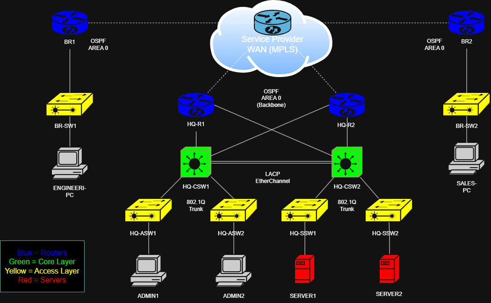

# Enterprise Network Topology

## Network Diagram

This lab simulates a small enterprise network consisting of a headquarters (HQ) and two branch offices connected over a service provider WAN (MPLS). The design demonstrates core networking concepts including routing, redundancy, VLAN segmentation, and scalable architecture.

## Architecture

- **WAN**: Service Provider MPLS network connecting all sites  
- **Routing Protocol**: OSPF Area 0 across all routers  
- **HQ Design**: Collapsed core with dual core switches (CSW1/CSW2)  
- **Branch Design**: Single router and access switch per branch  

## Network Layers

- **Core Layer**: HQ-CSW1 and HQ-CSW2 (Layer 3 switches)  
- **Access Layer**: HQ-ASW1/2 (users) and HQ-SSW1/2 (servers)  
- **Edge/WAN Layer**: HQ-R1 and HQ-R2

## Branch Sites

Each branch site consists of:

- **Branch Router (BR1 / BR2)** connected to the WAN  
- **Access Switch (BR-SW1 / BR-SW2)** for end devices  
- End-user devices (e.g. Engineer PC, Sales PC)  

Branch sites connect to HQ via the service provider WAN (MPLS) and participate in OSPF Area 0.

## Redundancy

The network is designed with multiple layers of redundancy to ensure high availability and fault tolerance across both the HQ and branch sites:

- **Dual Core Switches (Collapsed Core Design)**:  
  Two Layer 3 core switches (HQ-CSW1 and HQ-CSW2) provide redundancy at the core layer, ensuring continued operation if one switch fails.

- **HSRP (Hot Standby Router Protocol)**:  
  HSRP is configured on the core switches to provide default gateway redundancy for all VLANs. A virtual IP address is used as the gateway for end devices, allowing seamless failover between switches in the event of a failure.

- **EtherChannel (LACP)**:  
  An EtherChannel is configured between HQ-CSW1 and HQ-CSW2 using LACP. This provides both increased bandwidth and link redundancy while preventing Spanning Tree blocking.

- **Spanning Tree Protocol (STP)**:  
  Rapid PVST+ is used to prevent Layer 2 loops and ensure fast convergence. HQ-CSW1 is configured as the primary root bridge and HQ-CSW2 as the secondary.

- **Dual WAN Edge Routers**:  
  Two edge routers (HQ-R1 and HQ-R2) provide redundancy at the WAN edge, ensuring continued connectivity to the service provider network in the event of a router failure.

- **Redundant Core-to-Edge Connectivity**:  
  Each core switch is connected to both WAN edge routers, providing multiple paths between the LAN and WAN. This ensures traffic can still reach the WAN even if a single link or device fails.

- **OSPF Dynamic Routing (Area 0)**:  
  OSPF is used across all routers to provide dynamic routing and automatic failover. In the event of a link or device failure, OSPF recalculates routes to maintain connectivity.

- **Redundant Access Layer Uplinks**:  
  Access switches are connected to the core layer using trunk links, providing alternative paths to the network and improving resilience.

- **Service Provider WAN (MPLS)**:  
  The WAN is modelled as a service provider MPLS network, providing resilient connectivity between HQ and branch sites.

## Technologies Used

- OSPF (Area 0)
- VLANs and 802.1Q trunking
- EtherChannel (LACP)
