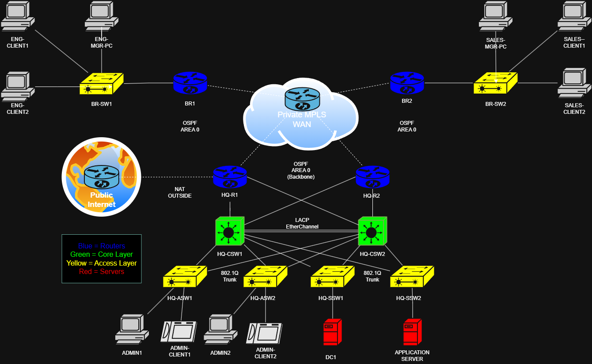

# Enterprise Network Topology – V2

## Network Diagram

This version of the lab represents an enhanced enterprise network design, building upon the original V1 implementation by introducing external connectivity and centralised services.

The topology simulates a more realistic production environment where an internal enterprise network connects to both a private WAN (MPLS-style) and the public internet via an edge router.

---

## What This Topology Demonstrates

- Multi-site enterprise network design (HQ + branch offices)
- Integration of private WAN and public internet connectivity
- NAT implementation at the network edge
- Centralised services hosted within the HQ environment
- Redundant core architecture using HSRP and dual core switches
- Dynamic routing across the WAN using OSPF
- High availability through multiple physical and logical paths

---

## Architecture Overview

- **Private WAN**: Simulated MPLS-style network using private IP addressing  
- **Public Internet**: External network accessed via NAT at the HQ edge  
- **Routing Protocol**: OSPF Area 0 across all Layer 3 devices  
- **HQ Design**: Collapsed core using dual Layer 3 switches  
- **Branch Design**: Single router and access switch per branch  
- **WAN Edge Devices**: HQ-R1, HQ-R2, BR1, BR2  
- **Internet Edge**: HQ-R1 providing NAT translation for outbound traffic  

---

## Network Layers

### Core Layer (HQ)
- HQ-CSW1  
- HQ-CSW2  

Layer 3 switches provide:
- Inter-VLAN routing (SVIs)  
- HSRP gateway redundancy  
- Core switching and traffic distribution  

---

### Access Layer
- HQ-ASW1 / HQ-ASW2 → Admin VLAN (VLAN 10)  
- HQ-SSW1 / HQ-SSW2 → Server VLAN (VLAN 20)  
- BR-SW1 → Engineering VLAN (VLAN 30)  
- BR-SW2 → Sales VLAN (VLAN 40)  

Provides:
- End-device connectivity  
- VLAN segmentation  
- Layer 2 security using DHCP Snooping, Dynamic ARP Inspection (DAI), and Port Security  

---

### WAN / Edge Layer

- HQ-R1  
- HQ-R2  
- BR1  
- BR2  

Provides:
- Connectivity between headquarters and branch sites  
- WAN edge routing across the private MPLS network  
- OSPF adjacency and route propagation across all sites  

---

### Internet Edge

- HQ-R1 (NAT boundary)

Provides:
- Connectivity from the internal network to the public internet  
- NAT (PAT) for translating private IP addresses to a public-facing address  
- Separation between internal enterprise traffic and external communication  

---

### Server Layer (HQ)

- DC1 → Domain Controller (DHCP, DNS, Active Directory)  
- Application Server  

Provides:
- Centralised network services  
- Dynamic IP address allocation (DHCP)  
- Name resolution (DNS)  
- Foundation for enterprise identity and application services  

---

## Branch Sites

Each branch site consists of:

### Branch 1 (Engineering)
- Network: 192.168.30.0/24  
- VLAN 30  
- Devices: BR1 + BR-SW1 + Engineering clients  

---

### Branch 2 (Sales)
- Network: 192.168.40.0/24  
- VLAN 40  
- Devices: BR2 + BR-SW2 + Sales clients  

---

### Key Design Choices

- Branch routers act as both default gateways and WAN edge devices  
- Single VLAN per branch for simplicity and clarity  
- Routing decisions handled at the branch edge (router)  
- Minimal Layer 2 complexity at branch sites  

---

## IP Addressing Strategy

### LAN Networks
- VLAN 10 (Admin): 192.168.10.0/24  
- VLAN 20 (Servers): 192.168.20.0/24  
- VLAN 30 (Engineering): 192.168.30.0/24  
- VLAN 40 (Sales): 192.168.40.0/24  

---

### WAN / Transit Networks
- 10.0.0.0/8 private address space used for point-to-point links  
- /30 subnets used for efficient addressing of router-to-router connections  

---

### Design Approach
- 192.168.x.x ranges are used for LAN and VLAN segmentation  
- 10.x.x.x range is reserved for WAN/transit networks  
- This separation improves clarity, scalability, and aligns with real-world enterprise addressing practices  

---

### Internet Access (V2 Enhancement)
- Private IP space is maintained internally  
- NAT is implemented at HQ-R1 for outbound internet access  
- Internal devices are not directly exposed to the public network  

---

## Redundancy Design

### Core Redundancy
- Dual core switches (HQ-CSW1 / HQ-CSW2)  
- HSRP for gateway redundancy  

---

### Layer 2 Redundancy
- EtherChannel (LACP) between core switches  
- Dual uplinks from access switches  
- Spanning Tree root placement aligned with HSRP  

---

### WAN Redundancy
- Dual HQ routers (HQ-R1 / HQ-R2)  
- Multiple paths to the MPLS WAN  
- OSPF convergence ensures failover  

---

### Routing Redundancy
- OSPF dynamic routing across all sites  
- Equal-cost load balancing (ECMP)  
- Automatic failover on link or device failure  

---

## Technologies Implemented

### Core (Inherited from V1)
- OSPF  
- VLANs  
- Inter-VLAN Routing  
- HSRP  
- EtherChannel  
- 802.1Q Trunking  
- Rapid PVST+  
- STP Enhancements (PortFast, BPDU Guard)  
- ACLs  
- DHCP Snooping & DAI  
- Port Security  

---

### Additional (V2 Enhancements)
- NAT (PAT)  
- Internet edge design  
- DHCP services (via DC1)  
- DNS services  
- Active Directory  
- Application hosting  

---

## Key Design Principles

- **Hierarchical network design** (Core + Access layers)  
- **Separation of internal and external networks**  
- **Private WAN with controlled internet access**  
- **Redundancy at every layer**  
- **Centralised services architecture**  
- **Scalability through dynamic routing (OSPF)**  

---

## Scope

This version extends the original V1 design by introducing internet connectivity and enterprise services.

It focuses on how internal enterprise networks integrate with external networks while maintaining security, segmentation, and scalability.

---

## Summary

This topology represents a more complete enterprise network design, demonstrating how internal infrastructure, WAN connectivity, and internet access are integrated in a real-world environment.

It builds upon the V1 foundation and showcases progression into more advanced networking concepts such as NAT, service centralisation, and edge design.
